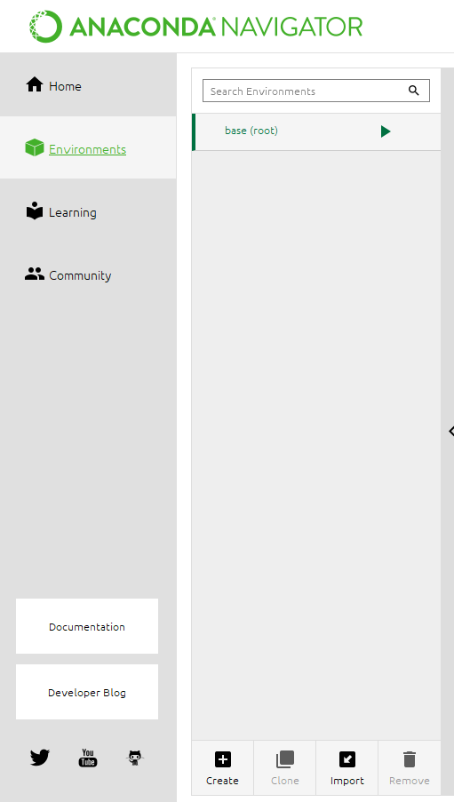
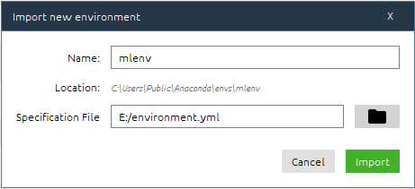
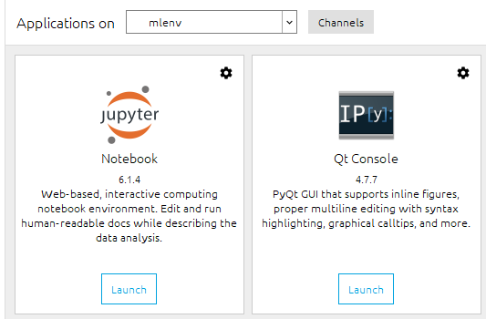

[](https://mybinder.org/v2/gh/tomorrowdata/machine-learning-course-notebooks.git/master)

# Jupyter Notebooks: Machine Learning
Notebooks for hands-on on machine learning supervised and unsupervised tasks.

## Notebook list

1. Hands-On 1: Python and Pandas Tutorial
2. Hands-On 2: Unsupervised Learning
3. Hands-On 3: Supervised Learning
4. Hands-On 4: Model Selection

<hr>

## Setup Environment on Windows

1. Get the Anaconda (Individual Edition) [here](https://www.anaconda.com/products/individual)

2. Install Anaconda on your machine. Pay attention when the installer asks for *Register Anaconda3 as my default Python 3.8*, untick it if you don't want to!

### Create Virtual Environment

1. Open **Anaconda Navigator** and select *Environments* on the left side panel <br><br>
2. Click *Import* and use the `environment.yml` as specification File. Use *mlenv* as name for the environment
   <br><br>
3. Once installed, go to the *Home* panel and be sure the installed environment is selected <br><br>
4. Launch jupyter notebook and navigate to the repository folder
5. Open the notebook you want to run

## Setup Environment on Linux

### Install miniconda

1. Download [miniconda](https://repo.anaconda.com/miniconda/Miniconda3-latest-Linux-x86.sh) the miniconda linux installer
2. Follow instructions [here](https://conda.io/projects/conda/en/latest/user-guide/install/linux.html) for installing miniconda


### Create Virtual Environment

To set up the conda environment with the required packages and running the notebooks, execute the following command:

1. Create a new virtual environment:
`conda env create -n mlenv -f=./environment.yml`

2. Set up the environment:
`conda activate mlenv`

3. Run jupyter notebooks:
`jupyter notebook`

<hr>

## Use Docker Compose

### Setting Up requirements

In order to build the docker image and start the development, install the following:

1. [Docker engine](https://docs.docker.com/engine/install/ubuntu/)
2. [Docker post-install](https://docs.docker.com/engine/install/linux-postinstall/)
3. [Docker Compose](https://docs.docker.com/compose/install/)


## Build the Docker Image

After all installetion requirements have been satisfied, run the following command in order to build the docker image with the project path as the current directory:

```bash
docker-compose build
```

## Start Jupyter Notebook

Jupyter Server will run into the docker container.
In order to run the container with all bindings and port mappings, run the following command:

```bash
docker-compose up -d
```

Once the **jupyter** service is up, the jupyter notebook will be accessible from `http://localhost:8887/`.

> The password is `tomorrowdata`.

The `notebook` amd `dataset` directories are bound to the container so files can be modified from both the host and inside the container.

## Stop the container

In order to stop the container, run:

```bash
docker-compose down
```

<hr>

# License


Except where otherwise noted, all content of this **machine-learning-course-notebooks** repository are distributed under [the Creative Common BY-SA-4.0 license](https://creativecommons.org/licenses/by-sa/4.0/)
